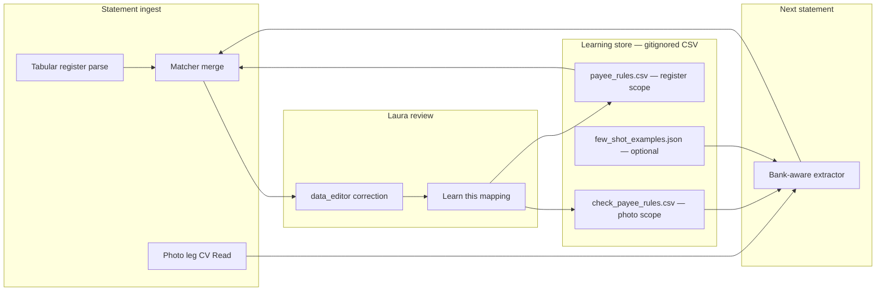

# Extractor Evolution Design — Photo-Leg Payee Quality

**Date**: 2026-05-27  
**Status**: **E0 + E1 + partial E2 + check rules implemented** (spike-only; no App wiring)  
**Scope boundary**: Photo leg only (check/deposit slip crops). Tabular register remains owned by `App/app.py` / existing parsers. See `HYBRID_CV_READ_SCOPE_CLARIFICATION.md`.

## Implementation Status (as of 2026-05-27)

| Track | Result |
|-------|--------|
| **Module** | `Scripts/spike/payee_extractor/` — engine, boilerplate, bank_detect, profiles, check rules |
| **HCC heavy manual (rubric-assist)** | **28 → 19** (`≤20` E1 gate **met**) |
| **HCC full wins (rubric-assist)** | **0 → 31** (automation; **overstated** on hard sample — see human row) |
| **HCC human 16-crop (v2 payees)** | **6 c / 10 w** — rubric false positive **10/16** |
| **HCC human 16-crop (human_v3 / profile_yaml_v4)** | **16/16** match human truth; **0** payee delta on profile refactor |
| **Profile-driven scoring** | `regions.yaml` — signature_markers + scoring (2026-05-27 refactor) |
| **HCC `REGIONS BANK` boilerplate** | **16 → 0** |
| **Traditions regression** | **0** downgrades on human-graded `correct` rows; **≥15** full wins on checks |
| **Artifacts** | `phase1_g2_hcc_202604__rescored_e1_regions/`, `phase1_real_cv_read_harness_*__rescored_e1_traditions/` |
| **Detail** | `Scripts/spike/E1_E2_STATUS.md` |

## Post-E1 Independent Review & Actions (2026-05-27)

Independent post-run review restored spike-only git hygiene, re-verified E1 artifacts, and tightened the global denylist (`payee_extractor/boilerplate.py`). **Authoritative numbers**: `Scripts/spike/POST_E1_VALIDATION_STATUS.md`.

| Action | Outcome |
|--------|---------|
| Revert production drift | `App/`, Azure Functions, README, Blueprint restored |
| Denylist v2 + `--rescore` | HCC obvious garbage **9 → 0**; Traditions `CASH >` **7 → 0** |
| Human handoff | `artifacts/HCC_E1_Human_Review_Package.md` (16 crops) |
| Page-7 CV errors | ~~**7**~~ **0** — retry complete (B2, 2026-05-27 evening) |

**Highest-value decisions now**: (1) **G1 Traditions-first sprint** — **approved B1**, (2) ~~page-7 CV retry~~ — **done**, (3) **third bank PDF** before default-on hybrid (B5). Handoff: `G1_HANDOFF_PACKAGE_INDEX.md`.

---

**Purpose**: Move from the current generic CV Read payee extractor toward bank- and client-aware extraction that generalizes beyond the Traditions-style hard PDF, while staying compatible with existing spike harnesses and the `payee_rules.csv` vendor-map mechanism.

**Evidence base**:
- Hard PDF (Traditions / Auto Body Center Jan-26): `Spike-Report-Computer-Vision-Check-Leg-20260527.md`, `Scripts/spike/PHASE1_NOTES.md`
- Second PDF (HCC / Regions Bank Apr-26): `Documents/g2_hcc_202604.md`
- Current extractor: `extract_payee_from_cv_lines()` in `Scripts/spike/phase1_cv_read_harness.py`
- Quality gate: `_is_clean_payee()` in `App/local_enhanced_ocr.py` (shared read-only import)
- Client vendor maps: `Data/payee_rules.csv` + `apply_payee_rules()` in `App/bank_statements.py`

---

## 1. Current State Assessment

### 1.1 What works (both statements)

| Layer | Hard PDF (Traditions) | HCC (Regions) | Verdict |
|-------|----------------------|---------------|---------|
| **Geometry cropper** | 56 crops = 49 checks + 7 deposits (ground truth) | 50 crops = statement “Enclosures 50” | **Generalizes** — two-stage dedup + page scoping is bank-agnostic |
| **Azure CV Read call success** | 56/56 (100%) | 43/50 succeeded; 7 errors (6 on page 7 tail) | **Mostly stable**; tail-page failures need spot-check, not architecture change |
| **Check vs deposit classifier** | 49 + 7 exact match | N/A (0 deposit crops on imaging pages) | **Works where deposits exist** |
| **End-to-end spike harness** | Phase 1 + Phase 5 complete | G2 harness + baseline smoke complete | **Operational** — `--rescore` enables zero-cost extractor iteration |
| **Cost / latency** | ~10 min F0 / ~$0.08 S1 for 56 crops | ~10 min combined for 50 crops | **Acceptable** at SLAM volume |

The **cropper + CV Read + classifier stack is validated**. G2 failure is isolated to **payee line selection and post-processing**, not imaging or register parsing.

### 1.2 What worked on Traditions only

On `Data/Auto_Body_Center_Jan_26_Statement.pdf`:

- **Automated clean rate**: 41/56 (73.2%) via `_is_clean_payee` after courtesy-amount filter — **~7×** vs EasyOCR (8.9%) on the same crops.
- **Human rubric** (`GRADING_GUIDE.md`, `PHASE1_NOTES.md`): **11 full wins / 14 light fixes / 24 still heavy** on 49 checks (~51% reduction in heavy manual toil).
- **Why the generic extractor succeeds here**:
  - Traditions check stock has a relatively clean “Pay to the order of” anchor with payee on the **next line** (`next_line` reason dominates).
  - Bank header text is less dominant inside the crop; security boilerplate is less frequently mis-selected as the payee.
  - Single-word business names often pass `_is_clean_payee` (≥6 chars, vowels) or arrive as multi-token strings.

### 1.3 What failed on Regions (HCC)

On `Data/HCC 2026-04.pdf` (`Documents/g2_hcc_202604.md`):

- **Automated clean rate**: 43/43 succeeded calls marked “clean” (86%) — **misleading**.
- **Human rubric**: **0 full wins / 22 light fixes / 28 still heavy** (56% heavy manual) — **no net uplift vs manual entry** for production-ready payees.
- **Failure modes** (ranked by frequency):

  1. **Boilerplate false positives (16 crops)** — extractor surfaces `REGIONS BANK`, security/counterfeit lines, `AUTHORIZED SIGNATURE`, truncated anchor text (`TY TO THE`). These pass or bypass `_is_clean_payee` because they look like alphabetic strings with vowels.
  2. **Surname fragments (most of the 22 “light fixes”)** — `Hernandez`, `*ernandez`, `ruandez` while raw Read JSON often contains fuller names lower in the crop (e.g. “Jesus Hernandez”, “Custom Concrete”). Anchor logic finds *a* line after “Pay to the order of” but not the *best* line.
  3. **CV Read errors (7)** — clustered on page 7 tail; may be scan quality, geometry, or rate-limit edge.
  4. **Empty / junk (5)** — no usable candidate after anchor search.

- **Critical insight**: CV Read **often captures the correct payee in `raw_text` or lower-confidence lines**; the generic extractor **selects the wrong line** or **accepts bank boilerplate** as the winner. This is a **ranking and rejection** problem, not primarily an OCR quality problem.

### 1.4 Root-cause summary

The current extractor (`extract_payee_from_cv_lines`) implements a fixed three-step policy:

1. Find first line containing “order of” / “pay to”.
2. Take same-line remainder or scan **next 1–3 lines** for the first `_is_clean_payee` match.
3. Fallback: first clean-looking line in the crop.

Gaps exposed by G2:

| Gap | Traditions impact | Regions impact |
|-----|-------------------|----------------|
| No **boilerplate denylist** (bank names, security phrases) | Low | **High** — primary failure mode |
| No **spatial scoring** (CV Read provides bounding boxes; unused) | Low | **High** — payee line has predictable Y/X band on Regions stock |
| No **multi-candidate ranking** (first clean wins) | Medium | **High** — better strings exist but rank lower |
| No **bank-specific anchor variants** | Low | Medium — composite layout, truncated anchors |
| **`_is_clean_payee` too permissive** for bank tokens | Low | **High** — `REGIONS BANK` passes heuristics |
| **Client vendor maps not applied to check-leg Payee** | Medium (14 light fixes helped post-merge by Description) | **High** — surname fragments need client context |

---

## 2. Architecture Options

Three approaches compared on expected lift, cost, bank detection, and vendor-map integration.

### 2.1 Option A — Generic (current + incremental hardening)

**Description**: Keep one extractor for all banks; add cross-bank improvements (boilerplate denylist, spatial heuristics, multi-candidate scoring, stricter `_is_clean_payee` extensions).

| Dimension | Assessment |
|-----------|------------|
| **Expected payee quality lift** | Traditions: **+5–10%** full wins (14 light → fewer heavy). Regions: **+15–25%** full wins if boilerplate rejected and spatial ranking added — still unlikely to match Traditions without layout-specific tuning. **Overall: moderate, uneven.** |
| **Implementation cost** | **Low** — ~2–4 days in spike; changes confined to `extract_payee_from_cv_lines` + shared denylist module; re-score both PDFs with `--rescore`. |
| **Maintenance cost** | **Low initially, rising** — each new bank adds edge cases to a growing denylist; risk of regressions on Traditions when tuning for Regions. |
| **Bank detection** | **Not required** — same code path everywhere. |
| **Client vendor maps** | **Post-extraction only** — `apply_payee_rules` matches on register `Description`, not check-leg OCR text. Helps merged rows when Description contains merchant tokens; **does not fix** check-photo payees that never match a Description pattern (common for handwritten payees). Optional extension: match rules against extracted payee *fragment* (e.g. `Hernandez` → client default vendor) — still generic, not bank-aware. |

**Best when**: Proving quick wins before committing to per-bank modules; acceptable if Laura continues heavy manual on some banks.

---

### 2.2 Option B — Per-bank routing + shared logic

**Description**: Detect bank (or check-stock family) once per statement; route to a **bank profile** that parameterizes shared extraction primitives (anchor phrases, Y-band for payee line, boilerplate sets, line-scan depth, MICR zone exclusion).

```
PDF → bank_detect() → BankProfile → shared ExtractorEngine(profile) → payee
```

| Dimension | Assessment |
|-----------|------------|
| **Expected payee quality lift** | Traditions: **maintain** 11 full wins; reduce 24 heavy → ~15–18. Regions: **target 8–15 full wins**, heavy manual **28 → 12–18** (~40–55% reduction) with Regions profile (denylist + spatial band + deeper line scan). **Overall: strong, predictable per bank.** |
| **Implementation cost** | **Medium** — ~5–8 spike days: `bank_profiles/` YAML or Python dicts, `detect_bank()` helper, refactor extractor into composable steps, two profiles (Traditions-family, Regions), harness regression on both G2 PDFs. |
| **Maintenance cost** | **Medium** — new bank = new profile (~0.5–2 days each after first); shared engine changes propagate to all profiles. Profiles are versioned artifacts, easy to diff. |
| **Bank detection** | See §2.5. Primary: register text on page 1 (`pdfplumber` / existing parser — **already parsed in baseline**, no new register ownership). Fallback: CV Read on first crop or client→bank lookup table. Confidence threshold → default to `generic` profile if unknown. |
| **Client vendor maps** | **Layer 2 after bank routing** — bank profile produces best-effort payee; `apply_payee_rules` runs on merged dataframe as today. Add optional **`check_payee_rules`** slice in same CSV (new column `scope=check|register|both`) or separate `check_payee_rules.csv` gitignored — **spike-only first**, App merge later. Client `client_override` column already supports per-client wins. |

**Best when**: G2 proves bank layout drives failure modes; we want generalization without N× full extractors.

---

### 2.3 Option C — Per-bank + per-client (full vendor map stack)

**Description**: Option B plus **client-specific extraction hints**: known payee vocabulary (surname → business name), preferred line patterns, check-number→vendor tables built from Laura’s corrections, and aggressive `client_override` rules applied at check-leg time.

| Dimension | Assessment |
|-----------|------------|
| **Expected payee quality lift** | Traditions clients: **11 → 18–22 full wins** for repeat vendors. HCC: **15–25 full wins** once “Hernandez / Custom Concrete / [client vendors]” maps exist — fragments become resolvable. **Diminishing returns** on first-time unknown payees. |
| **Implementation cost** | **High** — Option B plus client hint registry, UI/export path for learned mappings, check#→payee table from register linkage. **~10–15 spike days** for minimal loop; ongoing Laura-driven curation. |
| **Maintenance cost** | **High ongoing** — each client accumulates rules; needs governance (stale rules, conflicts, `last_used` hygiene — already in `payee_rules.csv`). |
| **Bank detection** | Same as Option B; client ID from Streamlit `selected_client` / CLI `--client-name` (already in `phase5_hybrid_pipeline.py`). |
| **Client vendor maps** | **First-class** — extend `payee_rules.csv` schema or add `check_vendor_map.csv`: `client_override,pattern_type,pattern,clean_payee,notes` where `pattern_type` ∈ {description_substring, payee_fragment, check_no, raw_ocr_regex}. Apply **before merge** on check leg and **after merge** on register (existing engine). Reuse `upsert_payee_rule()` / Learn-this-mapping UX when G1 wiring allows. |

**Best when**: Laura processes the same clients monthly; repeat payees dominate (true for SLAM). Highest ROI **after** Option B stabilizes bank layout handling.

---

### 2.4 Comparison matrix

| Criterion | A — Generic+ | B — Per-bank | C — Per-bank+client |
|-----------|-------------|--------------|---------------------|
| Regions full-win target | 0 → 3–8 | 0 → 8–15 | 0 → 15–25 |
| Traditions regression risk | Low | Low–medium | Low (if maps optional) |
| Spike effort (pre-G1) | 2–4 days | 5–8 days | 10–15 days |
| New bank onboarding | Patch denylist | Add profile | Add profile + client seeds |
| Uses existing harness | Yes | Yes | Yes |
| Uses `payee_rules.csv` | Post-merge only | Post-merge + optional check scope | Full stack |
| Fits scope boundary | Yes | Yes | Yes |

---

### 2.5 Bank detection design (Options B & C)

Detection runs **once per statement** before CV Read batch; **does not** parse or replace the tabular register.

| Signal | Source | Reliability | Notes |
|--------|--------|-------------|-------|
| **Register header text** | Page 1 text via existing baseline / `pdfplumber` | **High** | “Regions Bank”, “Traditions Bank”, routing numbers — already available in Phase 0 baseline artifacts |
| **Client → bank table** | Static JSON/YAML in spike: `Hernandez Custom Concrete → regions` | **High** | Zero ML; explicit for known SLAM clients |
| **MICR / routing on crops** | CV Read lines matching `\d{9}` transit patterns | Medium | Regions vs Traditions routing differs; useful confirm |
| **Check stock keywords** | First crop CV Read: “REGIONS BANK” header frequency | Medium | Fast bootstrap when register text is weak |
| **Default fallback** | `generic` profile | — | Same as hardened Option A |

**Spike implementation**: `Scripts/spike/bank_detect.py` returning `{bank_id, confidence, signals[]}`; unit tests on page-1 snippets from both G2 PDFs (local/gitignored text samples, not committed).

---

## 3. Automation & Learning Path

### 3.1 How much can be automated (without fine-tuning a custom model)

| Technique | Automatable share of remaining gap | Effort | Pre-G1 spike? |
|-----------|-----------------------------------|--------|---------------|
| **Boilerplate denylist + bank tokens** | 30–40% of Regions heavy cases | Low | **Yes** |
| **Spatial line ranking (bounding boxes)** | 20–30% | Medium | **Yes** |
| **Multi-candidate score + pick best** | 15–25% | Medium | **Yes** |
| **Per-bank profile parameters** | 10–20% incremental | Medium | **Yes** |
| **Prompt engineering (LLM on crop text)** | 20–40% on hard cases | Medium–high | Optional spike experiment; adds latency/cost |
| **Few-shot examples in LLM prompt** | +5–15% over zero-shot | Low per bank | Spike A/B only |
| **Post-OCR rules (`check_payee_rules`)** | 10–30% for repeat clients | Low | **Yes** (CSV-driven) |
| **Small custom classifier (payee vs boilerplate line)** | 15–25% | High | Defer post-G1 |
| **Periodic fine-tuning (Document Intelligence custom model)** | 30–50% at maturity | Very high | **Out of scope pre-G1**; evaluate only if rule+profile plateaus |

**Realistic pre-G1 automation ceiling**: **~60–70% of Regions heavy-manual crops** addressable with Options A+B hardening (no LLM, no fine-tuning). Remaining ~30%: handwritten payees, damaged scans, novel vendors — **Laura editor remains mandatory** per G1 brief.

### 3.2 Feedback loop — editor corrections → better extractions

Goal: When Laura fixes a Payee on the Bank Statements page, future statements for that client improve automatically.

**Proposed loop** (compatible with scope boundary — enriches Payee on existing rows only):



**Correction capture fields** (new spike artifact schema; App wiring deferred):

| Field | Purpose |
|-------|---------|
| `client_override` | Client name (existing column) |
| `scope` | `register` \| `check` \| `both` |
| `pattern` | Description substring, payee fragment, or `re:` regex on raw OCR |
| `clean_payee` | Laura’s corrected value |
| `source_crop_id` | Optional — links to `raw_cv_responses/` for few-shot |
| `bank_id` | Optional — restrict rule to Regions profile |
| `last_used` | Existing hygiene column |

**Trigger points** (future App; spike simulates via graded CSV):

1. **Explicit**: “Learn this mapping” on a corrected row — already writes to `payee_rules.csv`; extend to accept check-leg context when `ReviewReason` indicates CV payee.
2. **Implicit (opt-in)**: On export/save, diff `Payee` vs CV-suggested payee for linked check rows → queue suggested rules for Laura approval (never auto-write without confirm).

### 3.3 What “training” means in this system

| Training type | What it is | When to use |
|---------------|------------|-------------|
| **Rule learning** | New rows in `payee_rules.csv` / `check_payee_rules.csv` | Immediate — every Laura correction with a repeatable pattern |
| **Profile tuning** | Adjust YAML parameters (denylist, Y-band, scan depth) | After grading a new bank’s first statement |
| **Few-shot prompt updates** | Add 3–5 `{raw_lines, correct_payee}` examples per bank to LLM extractor | If LLM path adopted; store in gitignored JSON |
| **Cached rescore regression** | `--rescore` on all `raw_cv_responses/` when extractor changes | Every extractor PR — zero Azure cost |
| **Periodic fine-tuning** | Azure DI custom model or small line-classifier | Only if rule+profile plateau across ≥5 banks |

**No batch ML training pipeline is required for the near term.** The spike already supports the critical enabler: **frozen `raw_cv_responses/`** per statement → unlimited local iteration.

---

## 4. Recommended Path

### 4.1 Recommendation

**Adopt Option B (per-bank routing + shared logic) as the near-term architecture**, with **selective Option A hardening in the shared engine** and **Option C client maps as a thin Layer 2** (check-scoped rules only where fragments repeat).

Rationale:

1. G2 proved **layout/bank drives failure mode**, not CV Read availability or cropper quality.
2. Option A alone cannot reject `REGIONS BANK` without bank-aware context or denylists that become an implicit per-bank profile anyway.
3. Option C without Option B wastes client rules on boilerplate false positives that bank profiles should reject first.
4. All work stays in `Scripts/spike/`, `--rescore`-testable, and respects the photo-leg boundary.

### 4.2 Phased rollout (pre-G1 / inside spike)

| Phase | Deliverable | Success metric | Est. effort | **Actual (2026-05-27)** |
|-------|-------------|----------------|-------------|-------------------------|
| **E0 — Shared engine refactor** | `Scripts/spike/payee_extractor/` module: `Engine`, `Candidate`, `ScoreContext`; move logic out of harness; `--rescore` parity on Traditions | Bit-identical or improved on hard PDF automated clean count | 1–2 days | **Done** — `test_payee_extractor_smoke.py` legacy parity |
| **E1 — Cross-bank hardening** | Global boilerplate denylist; multi-candidate ranking; optional bbox Y-band heuristic; tighten `_is_clean_payee` bank-token rejection in spike copy | Regions rubric: heavy **28 → ≤20** on `--rescore` | 2–3 days | **Done** — heavy **19**; boilerplate **0** |
| **E2 — Bank detect + profiles** | `bank_detect.py`; `profiles/traditions.yaml`, `profiles/regions.yaml`; harness `--bank auto` | Regions: **≥8 full wins** on re-grade; Traditions: **≥11 full wins** (no regression) | 2–3 days | **Partial** — gates met on `--rescore`; full tuning loop open |
| **E3 — Check-scoped vendor maps** | `check_payee_rules.csv` schema + apply step in Phase 5; seed HCC fragment rules | HCC: **≥15 full wins** combined profile + client rules | 1–2 days | **Revised 2026-05-27** — 2 human-precision rules; broad LLC/Hernandez seeds **removed** after Laura review |
| **E4 — Grading + doc** | Re-run G2 rubric on both PDFs; update `Documents/g2_*` addendum; Phase 1 breakdown comparison | Documented lift table for owner | 0.5 day |
| **E5 — Optional LLM A/B** | Spike script: LLM ranks top-5 lines from cached JSON vs rule engine | Decision data only; not default path | 1–2 days optional |

**Gate before G1 integration**: E2 complete with **documented non-regression on Traditions** and **material Regions improvement** (target: heavy manual ≤40% on HCC vs 56% today).

### 4.3 Module layout (spike)

```
Scripts/spike/
├── payee_extractor/
│   ├── __init__.py
│   ├── engine.py          # shared ranking pipeline
│   ├── bank_detect.py
│   ├── profiles/
│   │   ├── generic.yaml
│   │   ├── traditions.yaml
│   │   └── regions.yaml
│   ├── boilerplate.py     # shared denylist + bank tokens
│   └── apply_check_rules.py
├── phase1_cv_read_harness.py   # thin wrapper → engine
└── phase5_hybrid_pipeline.py   # bank_detect + engine
```

Harness flags (additive):

- `--bank auto|traditions|regions|generic`
- `--check-rules-path Data/check_payee_rules.csv`
- Existing `--rescore` unchanged

---

## 5. Integration Considerations

Future wiring (post-G1 only) per `POST_SPIKE_INTEGRATION_PLAN.md` §3.1–3.2:

### 5.1 Where extractor logic lands

| Spike artifact | Future App module | Notes |
|----------------|-------------------|-------|
| `payee_extractor/*` | `App/hybrid_cv_check_leg.py` (name TBD) | Extracted during Sprint 3.1; spike imports same module for parity |
| `bank_detect.py` | Called once inside `_run_hybrid_check_leg()` | Uses page-1 text already available from register pass — **read-only**, no register re-parse |
| `apply_check_rules.py` | Invoked after `extract_payee`, before matcher | Complements existing `apply_payee_rules` on merged DF |

### 5.2 Hybrid pipeline seam (unchanged ownership model)

```
run_pipeline(check_leg_mode="hybrid_cv"):
  1. Register parse → 12-col transactions     [UNCHANGED — App/local_enhanced_ocr.py]
  2. bank_detect(page1_text, client_name)
  3. For each crop on imaging pages:
       CV Read → bank_profile → extract_payee → apply_check_rules
  4. _match_checks_to_transactions            [UNCHANGED matcher]
  5. apply_payee_rules(df, client_name)       [UNCHANGED — register Description scope]
  6. Return enriched dataframe                [same row count, same columns]
```

**Payee write-back policy** (product decision from `PHASE5_HYBRID_DESIGN.md`): only overwrite `Payee` when `_is_clean_payee` passes *and* confidence ≥ profile threshold; else leave blank for Laura. Hybrid **never creates register rows**.

### 5.3 `payee_rules.csv` integration

| Today | Proposed extension |
|-------|-------------------|
| Matches `Description` only | Add optional `scope` column: blank = register (backward compatible) |
| `client_override` for client-specific wins | Same — applies to check rules |
| Learn-this-mapping UI | When row has linked check + CV metadata, pre-fill pattern from OCR fragment |
| Gitignored `Data/` | `check_payee_rules.csv` lives beside `payee_rules.csv`; same path resolution |

### 5.4 What does NOT change at integration

- Tabular parsers, row counts, reconciliation totals
- Default `check_leg_mode="strict"` until feature flag + Laura UAT
- `GROK_CSV_COLUMNS` (Option A schema)
- Azure Function strict path

---

## 6. Risks & Open Questions

### 6.1 Risks

| Risk | Likelihood | Impact | Mitigation |
|------|------------|--------|------------|
| **Traditions regression** when tuning Regions profile | Medium | High | `--rescore` regression on both PDFs required for every extractor change; Traditions profile frozen unless explicit |
| **Bank detect mis-routes** unknown bank to wrong profile | Medium | Medium | Confidence threshold + `generic` fallback; log `bank_id` in artifacts |
| **Over-fitting to two banks** | High | Medium | Third G2-style PDF before production default; generic profile must remain safe |
| **Handwritten payees remain heavy manual** | High | Medium | Set expectations in UI; do not mark `Confidence=High` without clean payee |
| **Client rule explosion / stale rules** | Medium | Low–medium | Reuse `last_used`; periodic review in Rules Library |
| **Scope creep into register parsing** | Low | High | Code review against `HYBRID_CV_READ_SCOPE_CLARIFICATION.md`; extractor receives crops + metadata only |
| **LLM path latency/cost** | Medium | Medium | Keep rule engine as default; LLM opt-in per client if ever added |

### 6.2 Open questions

1. **Regions page-7 CV failures** — re-run spot-check with S1 tier and single-crop retry before attributing to extractor vs API flake?
2. **Deposit slips on Regions** — HCC had 0 deposit crops on imaging pages; do we need a Regions deposit profile before claiming deposit-leg generalization?
3. **Check# → payee table** — should matcher-linked historical rows auto-seed `check_payee_rules` for repeat check numbers (same payee monthly)?
4. **Schema for `scope` column** — extend `payee_rules.csv` vs separate `check_payee_rules.csv`? Recommendation: **separate file** for anti-bloat and clearer Roles Matrix alignment (register rules vs photo rules).
5. **BBox reliability** — does CV Read bounding box Y-ordering hold across scan DPI variants? Validate on HCC `--rescore` before building spatial ranker.
6. **G1 timing** — proceed with bounded integration (Traditions-first feature flag) while Regions profile matures, or delay G1 until E2 Regions targets met?

### 6.3 Success metrics (extractor evolution complete)

| Metric | Traditions (maintain) | Regions (improve) |
|--------|----------------------|-------------------|
| Full wins (`c`) | ≥ 11 | ≥ 8 (E2) → ≥ 15 (E3) |
| Still heavy (`w/e/b`) | ≤ 24 | ≤ 18 (from 28) |
| Automated clean vs rubric agreement | ≥ 80% | ≥ 70% (reduce false “clean”) |
| `--rescore` regression | 0 unintended payee downgrades | — |

---

## 7. References

| Document | Role |
|----------|------|
| `HYBRID_CV_READ_SCOPE_CLARIFICATION.md` | Scope boundary — photo leg only |
| `Documents/g2_hcc_202604.md` | G2 Regions grading evidence |
| `Scripts/spike/PHASE1_NOTES.md` | G2 Traditions grading evidence |
| `Scripts/spike/GRADING_GUIDE.md` | Rubric codes (`c/s/p/w/e/b`) |
| `Scripts/spike/phase1_cv_read_harness.py` | Current extractor + `--rescore` |
| `Scripts/spike/phase5_hybrid_pipeline.py` | End-to-end spike orchestrator |
| `Scripts/spike/POST_SPIKE_INTEGRATION_PLAN.md` | Future App wiring gates |
| `App/bank_statements.py` | `apply_payee_rules`, `payee_rules.csv` |
| `App/local_enhanced_ocr.py` | `_is_clean_payee`, matcher (read-only) |

---

**Next action**: Laura grades `artifacts/HCC_E1_Human_Review_Package.md`; decide G1 timing vs page-7 CV retry. See `POST_E1_VALIDATION_STATUS.md` and `E1_E2_STATUS.md`.
