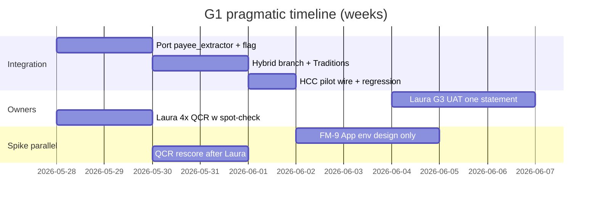

# G1 Readiness Snapshot (Pragmatic — Post-B5)

**Date**: 2026-05-27  
**Audience**: Integration sprint, Robert, Laura  
**Purpose**: Honest current state — what to wire today, what carries risk, what to stop investing in.

**Supersedes** informal “we’re ready” reads; pair with `G1_HANDOFF_PACKAGE_INDEX.md` for paths.

---

## 1. Executive verdict

| Scope | Verdict | Confidence |
|-------|---------|------------|
| **Traditions-first G1** | **Wire now** | High — 0 Traditions downgrades; smoke green |
| **HCC / Regions pilot** | **Wire in same sprint** (feature-flagged) | High — 50/50 human-validated + 6 rules |
| **QCR / First Metro** | **Not G1** — optional pilot after UAT | Low on payee; cropper gap documented |
| **Default-on hybrid (all clients)** | **No-go** | Until G3 UAT + FM-9 in App + QCR payee re-validation |

**Shift**: Move from analysis/repair to **App integration + Laura UAT**. Spike work on FM-7/FM-9 is **documented PoC**, not a G1 blocker for Traditions/HCC.

---

## 2. Ready to wire today (integration team)

| Deliverable | Location | Production-grade? |
|-------------|----------|-------------------|
| Payee engine + profiles | `Scripts/spike/payee_extractor/` | **Yes** for Traditions + HCC |
| HCC blessed bundle | `…_p7_full_human/` + `HCC_E1_FULL_HUMAN_GROUND_TRUTH.csv` | **Yes** |
| Check rules (6) | `Data/check_payee_rules.csv` | **Yes** |
| Perez policy (B3) | `PEREZ_OCR_POLICY.md` | **Binding** |
| Regression gate | `test_payee_extractor_smoke.py` (15 active) | **Yes** — passes 2026-05-27 |
| Hybrid design + sprint checklist | `POST_SPIKE_INTEGRATION_PLAN.md`, `PHASE5_HYBRID_DESIGN.md` | **Design ready** — no App code yet |
| Cropper dedup (B6) | Spike harness → merge to App | **Proven** in spike; **not** App-wired |

**Integration can start Day 1**: port `payee_extractor`, feature flag, Traditions profile, hybrid pipeline branch per `POST_SPIKE_INTEGRATION_PLAN.md` §3.

---

## 3. Too risky or incomplete for G1 scope

| Item | Why not blocking Traditions/HCC | Why not default-on / QCR pilot |
|------|--------------------------------|--------------------------------|
| **FM-9 imaging pages** | Traditions/HCC use known page range (5–9) | PoC only; **not** validated in App; QCR needs 9–10 not 5–8 |
| **FM-7 payer header** | HCC uses signature + rules; substring optional | QCR rescore **not** re-run with penalty; 4/16 material `w` on imaged checks remain |
| **QCR payee accuracy** | Out of G1 approved scope | 5/16 strict `c`; 4 material wrong payees |
| **First Metro profile** | Pilot artifact only | `first_metro.yaml` — load for future pilot, not G1 wire |
| **FM-8 amount-in-words** | Not observed on HCC 50 | QCR edge cases — defer |
| **App hybrid UI / CV keys** | Expected G1 sprint work | Laura G3 UAT blocked until wired |

---

## 4. FM-7 / FM-9 — honest PoC status (do not sugarcoat)

| PoC | What exists | What does **not** exist | G1 critical path? |
|-----|-------------|-------------------------|---------------------|
| **FM-7** | Scoring penalty in `engine.py`; `regions.yaml` + `first_metro.yaml` | QCR `--rescore` proof that 4 `w` → `c`; per-client substring workflow in App | **No** for Traditions/HCC |
| **FM-9** | `--detect-imaging-pages` on cropper harness; writes `imaging_pages.json` | App env wiring; validation that QCR pages 5–8 would crop; Laura sign-off on page range | **No** for Traditions/HCC |

**Recommendation**: Port FM-7 profiles with G1 package; **do not** delay Traditions/HCC wiring for QCR rescore. Schedule FM-9 App merge in week 2 parallel to Laura UAT.

---

## 5. Realistic timeline & dependencies



| Week | Integration team | Spike (only if bandwidth) | Owners |
|------|------------------|---------------------------|--------|
| **1** | Port engine; Traditions + HCC pilot; smoke + hard PDF | FM-9 design note for `SLAM_IMAGING_*` | Laura: 4 QCR `w` spot-check |
| **2** | Cropper dedup merge; feature flag OFF in prod | Optional QCR rescore after Laura | Laura: G3 UAT one statement |
| **3+** | Stabilize from UAT feedback | First Metro pilot **if** UAT pass + cropper validated | Robert: Azure tier decision |

**Dependency chain**: G3 UAT → pilot client expansion → default-on discussion (not before).

---

## 6. Sequencing (what / when / who)

### Start immediately (integration)

1. Port `payee_extractor/` to App-shared module path.
2. `check_leg_mode` branch; default **strict**; `SLAM_HYBRID_CV_ENABLED=false` in prod.
3. Traditions profile + regression (92 rows, smoke).
4. HCC pilot: `regions.yaml` + 6 rules + `full_human` cache path.

### Spike first (before QCR / First Metro pilot only)

1. FM-9 detector output → documented `SLAM_IMAGING_FIRST_PAGE` / `LAST_PAGE` per bank (design + one QCR re-crop).
2. FM-7 QCR rescore validation **after** Laura spot-checks 4 `w` crops.

### Defer until after initial Laura UAT

- Default-on all clients.
- First Metro production pilot.
- FM-8 amount-in-words filter.
- Further HCC profile tuning (50/50 met).
- Additional bank PDFs beyond B5.
- S1 tier / Function offload (G4).

---

## 7. Stop doing (deprioritize now)

| Stop | Reason |
|------|--------|
| More HCC rescoring / profile_yaml iterations | 50/50 + full human validation complete |
| Expanding FM-7/FM-9 PoC before App wire | Not on Traditions/HCC critical path |
| New check rules for QCR without Laura spot-check | Validation-only until human confirms OCR strings |
| Chasing 16/16 strict `c` on QCR before cropper fix | Page-scope dominates; 4 `w` may move after FM-9 |
| Additional third/fourth bank PDFs | B5 process requirement met |
| Perfecting spike harness UX | Integration needs stable contracts, not polish |
| Duplicating metrics across status docs | Use this snapshot + `LATEST_HCC_E1.txt` |
| App changes from spike agents | Boundary: integration sprint owns `App/` |

---

## 8. Open decisions (owner input)

| # | Question | Options | Who |
|---|----------|---------|-----|
| 1 | HCC pilot same sprint as Traditions? | **Recommended: yes** (flagged) | Robert — confirm |
| 2 | Azure CV tier for prod pilot | F0 dev / S1 prod | Robert — before prod |
| 3 | G3 UAT statement choice | Traditions hard PDF vs live client PDF | Laura |
| 4 | First Metro pilot timing | After week 2 UAT vs defer | Robert / Laura |
| 5 | Widen CV payee write-back to unmatched checks? | Product call in sprint 3.2 | Robert / Laura |

---

## 9. Smoke test

```bash
python Scripts/spike/test_payee_extractor_smoke.py
```

**Status (2026-05-27)**: **PASS** — 15 active tests.

---

## Document map

| Need | Read |
|------|------|
| Artifact paths | `G1_HANDOFF_PACKAGE_INDEX.md` |
| Week plan | `G1_IMPLEMENTATION_ROADMAP.md` |
| Owner 1–2 pages | `POST_B5_OWNER_SUMMARY.md` |
| B5 evidence | `QCR_B5_VALIDATION_REPORT.md` |
| FM-7/9 design | `FM7_FM9_SPIKE_NOTES.md` |
