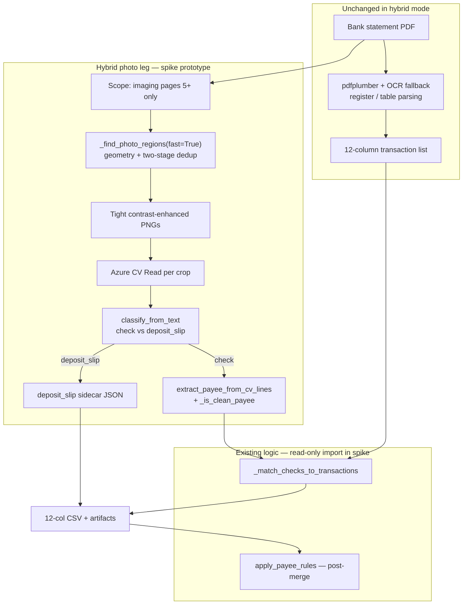

# Phase 5 Design — Hybrid CV Read Check Leg (Spike-Only, No Live Wiring)

**Date**: 2026-05-27  
**Status**: Prototype implemented — `Scripts/spike/phase5_hybrid_pipeline.py` (spike-only; no App wiring). Spike closed Phase 7 — integration per `POST_SPIKE_INTEGRATION_PLAN.md`.  
**Schema**: **Option A** (12-column freeze) per `SCHEMA_DECISION.md` (owner choice **A-then-B**)  
**Explicit non-goals for this phase**: No changes to `App/bank_statements.py`, Bank Statements UI radios, `requirements.txt`, Azure Function deploy, or default Local Enhanced OCR behavior. **EasyOCR strict path remains the live default.**

---

## 1. Purpose

Replace only the **check-photo OCR leg** (payee extraction from embedded check/deposit images) with:

**fast geometry + two-stage dedup → Azure CV Read on crops → cheap text classifier → existing matcher/payee guards**

while leaving unchanged:

- Register/table parsing (pdfplumber fast path + EasyOCR fallback for **text**, not for photo detection)
- Canonical **12-column** transaction export
- Payee rules engine, reconciliation banner, `data_editor`, pivot, Power Query CSV download

Phase 5 **design** defines the spike prototype boundary, artifacts, and a future App integration checklist. Implementation stays in `Scripts/spike/` until a separate owner-approved integration sprint.

---

## 2. Architecture (surgical hybrid)



**Validated on hard PDF** (`Data/Auto_Body_Center_Jan_26_Statement.pdf`):

| Stage | Reference |
|-------|-----------|
| Geometry + dedup | Phase 3 back-port; harness `diagnose_check_deposit_cropper.py` |
| CV Read quality | Phase 1 `phase1_cv_read_harness.py` (56/56, 73.2% vs 8.9% EasyOCR) |
| Human grading | 11 / 14 / 24 on 49 checks; 7/7 deposits (`PHASE1_NOTES.md`) |

---

## 3. Page scoping (mandatory)

**Problem**: `fast=True` on the **full PDF** can emit ~2 spurious regions on page 10 (reconciliation sheet).

**Rule for spike prototype and future App mode**:

| Parameter | Default | Notes |
|-----------|---------|-------|
| `first_imaging_page` | `5` | Traditions-style statements; configurable per bank template later |
| `last_imaging_page` | `9` or auto | Stop before reconciliation when page 10 has no photos |
| `exclude_pages` | `[10]` optional | Explicit deny-list for known non-imaging tails |

**Implementation sketch**: filter `regions` where `first_imaging_page <= page <= last_imaging_page` immediately after `_find_photo_regions` returns. Do **not** change production `_find_photo_regions` signature in the spike phase; filter in the spike orchestrator only.

---

## 4. Schema contract (Option A)

All spike outputs that represent **transactions** must use `GROK_CSV_COLUMNS` / `TRANSACTION_FIELDS` (12 columns). No `TransactionType` or `RunningBalance` in the primary CSV.

### Check rows (after matcher)

| Column | Hybrid source |
|--------|----------------|
| `Payee` | CV Read payee if `_is_clean_payee` passes; else leave prior value / blank for Laura |
| `Confidence` / `NeedsReview` / `ReviewReason` | Existing matcher rules + `linked_check_id` semantics |
| `Check#` | Unchanged from register; matcher may refine from MICR in CV text |
| `Amount` / `SignedAmount` | Unchanged from register parsing |

### Deposit slips (Option A — sidecar, not a 12-col row type)

Deposit slips are **not** written as payees (`"DEPOSIT TICKET"` must not land in `Payee`).

Spike artifact: `deposit_slips.json` (or rows in `hybrid_photo_manifest.csv`):

```json
{
  "crop_id": "P05_K05_...",
  "page": 5,
  "predicted_class": "deposit_slip",
  "cv_read_raw_text": "...",
  "matched_transaction_index": null,
  "notes": "For credit-side P&L attribution in Phase 6; Option B adds TransactionType"
}
```

**Phase 6 P&L smoke** can join credit rows (`SignedAmount > 0`, `Description` contains deposit patterns) with sidecar text for Laura-facing narrative — still within 12-col.

---

## 5. Spike module layout (proposed)

Keep one orchestrator; reuse existing spike modules (no duplication of CV client code).

| Artifact | Role |
|----------|------|
| **`phase5_hybrid_pipeline.py`** (implemented) | End-to-end spike runner: PDF in → 12-col + sidecars out |
| `diagnose_check_deposit_cropper.py` | Optional alternate crop source (`final_kept/`); harness remains tuning SSOT |
| `phase1_cv_read_harness.py` | Reuse: `classify_from_text`, `extract_payee_from_cv_lines`, `call_cv_read` / polling, `--rescore` |
| `fast_cv_photo_processor.py` | Reference for fast detection timing; superseded by orchestrator page filter |
| `baseline_current_ocr.py` | Supply **register transactions** input (12-col) without re-implementing parser |

### `phase5_hybrid_pipeline.py` — planned CLI (design only)

```powershell
# Spike-only: merge register baseline + CV check leg (no App/UI)
python Scripts/spike/phase5_hybrid_pipeline.py `
  --pdf Data/Auto_Body_Center_Jan_26_Statement.pdf `
  --baseline-dir Scripts/spike/artifacts/baseline_<UTC> `
  --first-imaging-page 5 --last-imaging-page 9 `
  --real

# Zero-cost full path: harness crops + cached phase1 CV JSON (IDs must match)
python Scripts/spike/phase5_hybrid_pipeline.py `
  --pdf Data/Auto_Body_Center_Jan_26_Statement.pdf `
  --baseline-dir Scripts/spike/artifacts/baseline_<UTC> `
  --harness-dir Scripts/spike/artifacts/crop_diagnosis_20260527T001907Z `
  --reuse-cv-dir Scripts/spike/artifacts/phase1_real_cv_read_harness_20260526T195813Z__rescored/raw_cv_responses `
  --first-imaging-page 5 --last-imaging-page 9

# Dry run: detection + export only (no Azure)
python Scripts/spike/phase5_hybrid_pipeline.py `
  --pdf Data/Auto_Body_Center_Jan_26_Statement.pdf `
  --baseline-dir Scripts/spike/artifacts/baseline_<UTC> `
  --dry-run
```

### Planned output bundle

```
Scripts/spike/artifacts/phase5_hybrid_<UTC>/
├── transactions_hybrid.csv          # 12-column, payees updated on matched checks
├── deposit_slips.json               # 7 deposit cohort + metadata
├── hybrid_photo_manifest.csv        # per-crop: page, class, payee, clean?, image_path
├── hybrid_run_summary.json          # counts, wall time, Azure calls, estimated cost
├── crops/                           # PNGs for visual QA
└── phase5_hybrid_report.md          # human-readable summary
```

---

## 6. Processing steps (orchestrator detail)

### Step 0 — Inputs

1. **PDF** bytes.  
2. **Baseline transactions** — 12-column list from `baseline_current_ocr.py` (or `run_pipeline` export) so register rows exist before check linking.  
   - Hybrid prototype does **not** re-parse the register with CV Read.

### Step 1 — Fast photo regions

- Call `local_enhanced_ocr._find_photo_regions(pdf_bytes, fast=True, purpose="cv_read")` via read-only import (same pattern as `fast_cv_photo_processor.py`).
- Apply **page filter** (§3).
- Log: `regions_before_filter`, `regions_after_filter`, `detect_wall_sec`.

**Do not** call `_crop_checks(fast=False)` in the hybrid path (that loads EasyOCR for detection).

### Step 2 — Azure CV Read

- Reuse `phase1_cv_read_harness.py` Read client + rate limiting (`--rate-limit-seconds 3.2` on F0).
- One transaction = one crop image (billing).
- Persist `raw_cv_responses/<crop_id>.json` for free `--rescore` iterations.

### Step 3 — Classify + extract

- `classify_from_text(raw_text)` → `check` | `deposit_slip` | `unknown`
- Checks: `extract_payee_from_cv_lines` + courtesy-amount filter + `leo._is_clean_payee`
- Deposits: skip payee path; append to `deposit_slips.json`

### Step 4 — Build pseudo-detections for matcher

Production matcher expects EasyOCR-style `detections_by_id: check_id → [(bbox, text, conf), ...]`.

Spike adapter (new small helper in orchestrator):

- Convert CV Read lines into synthetic detections list (text + nominal confidence).
- Map crop `check_id` → detections for `_match_checks_to_transactions`.

**Read-only imports** from `App/local_enhanced_ocr.py`:

- `_match_checks_to_transactions`
- `_is_clean_payee`
- `_extract_payee_from_check_detections` (fallback if line-based extract empty)

### Step 5 — Merge + export

- Deep-copy baseline transactions; run matcher; write `transactions_hybrid.csv` in `GROK_CSV_COLUMNS` order.
- Optional: run `apply_payee_rules` in-process for spike parity with UI (read-only import from `bank_statements.py`).

### Step 6 — Cost / latency logging

`hybrid_run_summary.json` fields:

```json
{
  "cv_read_calls": 56,
  "cv_read_wall_sec": 630,
  "detect_wall_sec": 45,
  "estimated_cost_usd_s1_g2": 0.084,
  "tier": "F0",
  "pages_scoped": "5-9",
  "checks_classified": 49,
  "deposits_classified": 7
}
```

---

## 7. What stays untouched (production)

| Surface | Phase 5 design stance |
|---------|----------------------|
| Default Bank Statements → Local Enhanced OCR | Strict EasyOCR crop path (`fast=False`) |
| `_crop_checks()` default | Unchanged for live callers |
| `run_pipeline()` | No hybrid branch until integration sprint |
| Payee rules CSV format | Unchanged |
| `GROK_CSV_COLUMNS` | Frozen (Option A) |
| Power Query / `Process-Statement.ps1` | No new columns |

Phase 3 improvements (two-stage dedup) already benefit strict path survivors; that is independent of hybrid.

---

## 8. Future App integration checklist (NOT Phase 5)

Execute only after spike prototype validates on hard PDF + owner sign-off:

1. **UI**: New radio under Bank Statements — e.g. “Local Enhanced + CV Read (imaging pages)” with tooltip that register parsing is unchanged.
2. **Pipeline branch** in `run_pipeline`: if hybrid mode → call internal `_run_hybrid_check_leg()` (thin wrapper, not a fork of entire pipeline).
3. **Env**: `AZURE_CV_ENDPOINT`, `AZURE_CV_KEY` (already in `.env` sample); never commit keys.
4. **Page scope**: `SLAM_IMAGING_FIRST_PAGE`, `SLAM_IMAGING_LAST_PAGE` App Settings.
5. **Feature flag**: default off in production until Laura UAT.
6. **Deposit slips**: show sidecar summary in expander under reconciliation banner (read-only text for credit rows).
7. **Option B later**: dual export + vNext adapter per `SCHEMA_DECISION.md`.

---

## 9. Risks and mitigations (spike + future)

| Risk | Mitigation |
|------|------------|
| Page 10 false positives | Page filter in orchestrator (§3) |
| CV payee still wrong on ~24/49 checks | Human-in-the-loop editor + payee rules; hybrid is assistive |
| F0 rate limit | Document wall time; paid tier for production |
| Matcher amount/sign | Use register `SignedAmount` as authority; CV amount optional |
| Deposit attribution without `TransactionType` | Sidecar JSON + Phase 6 join to credit rows |
| Importing `App/` from spike | Read-only; no production file edits during spike |

---

## 10. Verification plan (when `phase5_hybrid_pipeline.py` exists)

```powershell
# 1. Baseline register (strict — unchanged path)
python Scripts/spike/baseline_current_ocr.py `
  --pdf Data/Auto_Body_Center_Jan_26_Statement.pdf `
  --out-dir Scripts/spike/artifacts/baseline_for_phase5

# 2. Hybrid spike run (design target)
python Scripts/spike/phase5_hybrid_pipeline.py `
  --pdf Data/Auto_Body_Center_Jan_26_Statement.pdf `
  --baseline-dir Scripts/spike/artifacts/baseline_for_phase5 `
  --first-imaging-page 5 --last-imaging-page 9 --real

# 3. Compare payee column vs baseline side-by-side (manual or small diff script)
```

**Success criteria for spike prototype**:

- 49 + 7 photo regions on pages 5–9 (match Phase 1 harness).
- `transactions_hybrid.csv` validates against `GROK_CSV_COLUMNS`.
- Measurable payee improvement on check rows vs baseline EasyOCR (spot-check against PDF photos).
- `deposit_slips.json` contains 7 entries with full CV text.
- No files modified under `App/` except future explicit integration PR.

---

## 11. Relationship to Phase 6 (P&L smoke)

Phase 6 will consume **`transactions_hybrid.csv`** (12-col) plus **`deposit_slips.json`**:

- Pivot: `build_statement_pivot` logic replicated in a small spike script (`phase6_pl_smoke.py`) using `SignedAmount` and `YearMonth`.
- Include credit-side rows enriched with deposit sidecar notes in report markdown (not new columns until Option B).

---

## 12. References

| Document | Use |
|----------|-----|
| `SCHEMA_DECISION.md` | A-then-B recorded |
| `Spike-Plan-Microsoft-Document-Intelligence-PnL.md` | Overall spike sequence |
| `PHASE1_NOTES.md` | CV Read metrics + grading cohort |
| `PHASE1_CROPPER_GAP_DIAGNOSIS.md` | Composite raster + cropper |
| `phase1_cv_read_harness.py` | CV + classifier implementation to reuse |
| `App/local_enhanced_ocr.py` | Matcher + `_find_photo_regions` (read-only) |

---

*Phase 5 prototype complete under `Scripts/spike/`. Next: Phase 6 P&L smoke on `transactions_hybrid.csv` + `deposit_slips.json`. No live App wiring until a separate integration approval.*
