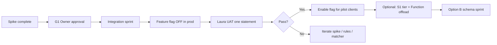

# Post-Spike Integration Plan — Azure CV Read Hybrid Check Leg

> **Historical note (2026-05-30):** Any Codespace execution targets in this plan are superseded by **local Windows** per v2.44.16. See [`docs/environment-policy.md`](../../docs/environment-policy.md).

**Date**: 2026-05-27  
**Status**: Spike **COMPLETE** (Phases 0–7). **Live App integration NOT started** — requires explicit owner approval per sprint gates below.  
**Primary reference**: `Spike-Report-Computer-Vision-Check-Leg-20260527.md` (repo root)

**Scope note**: All work under this plan is governed by `Scripts/spike/HYBRID_CV_READ_SCOPE_CLARIFICATION.md` (photo leg enhancement only; tabular register remains owned by `App/app.py`).

**Payee extractor (2026-05-27 evening)**: Owner decisions B1–B6 addressed. **Page-7 CV retry complete** (7/7 recovered → 50/50 HCC automated clean). **Perez OCR policy locked** (`PEREZ_OCR_POLICY.md`). **G1 Traditions-first sprint approved**. Handoff: `G1_HANDOFF_PACKAGE_INDEX.md`.

**Pragmatic G1 prep (2026-05-27)**: B5 third PDF complete; FM-7/FM-9 PoCs documented but **not** G1 blockers for Traditions/HCC. Honest state: `G1_READINESS_SNAPSHOT.md`. Owner summary: `POST_B5_OWNER_SUMMARY.md`. **Integration may start App wiring now**; spike continues FM-7/FM-9 in parallel for QCR-only follow-up.

---

## 1. Spike closure (what was proven)

| Phase | Deliverable | Outcome |
|-------|-------------|---------|
| 0 | `baseline_current_ocr.py`, `PHASE0_NOTES.md` | Register baseline captured; EasyOCR check-leg weakness documented |
| 1 | `phase1_cv_read_harness.py`, visual grading | **56/56** CV Read; **73.2%** vs **8.9%** EasyOCR clean payees; **49+7** classified; ~**51%** reduction in heavy manual payee work |
| 3 | Production cropper back-port | Two-stage dedup in `App/local_enhanced_ocr.py`, `smart_check_cropper_final_dynamic.py`, `AzureFunctions/ocr_processor/function_app.py` |
| 4 | `SCHEMA_DECISION.md` | **Option A-then-B** — 12-column freeze for hybrid; vNext later |
| 5 | `phase5_hybrid_pipeline.py`, `PHASE5_HYBRID_DESIGN.md` | End-to-end spike orchestrator; **no App wiring** |
| 6 | `phase6_pl_smoke.py`, `PHASE6_NOTES.md` | P&L pivots on hybrid CSV; deposit sidecar attribution narrative |
| 7 | This plan + spike report + archival index | Operational guidance for integration sprint |

**Architectural verdict (validated)**: Fast geometry-only cropper → per-crop Azure CV Read → cheap check/deposit classifier → existing matcher/payee guards. Register parsing unchanged.

---

## 2. Explicit gates before any App integration

Do **not** merge hybrid into `App/` or change Bank Statements default behavior until **all** of the following are satisfied:

| Gate | Owner / team action |
|------|---------------------|
| **G1 — Integration approval** | **Approved B1** (2026-05-27) — Traditions-first sprint may begin. Consume `G1_HANDOFF_PACKAGE_INDEX.md`. |
| **G2 — Second statement** | … **human_v3 / profile_yaml_v4** rescore **16/16** on that set; … **PRE_G1_INTEGRATION_CHECKLIST.md** for sign-off items. |
| **G3 — Laura UAT** | Laura processes one statement end-to-end with hybrid-assisted payees; confirms editor + rules + reconciliation still feel safe. |
| **G4 — Azure tier** | Decide F0 (dev only) vs S1 G2 (production); document expected wall time at SLAM volume. |
| **G5 — Secrets** | `AZURE_CV_*` in App Service App Settings or local `.env` only; never in git. |

Until G1: **EasyOCR strict path remains the production default.**

---

## 3. Recommended integration sprint (ordered)

Estimated **2–4 focused days** after G1. Copy checklist from `PHASE5_HYBRID_DESIGN.md` §8, expanded:

### Sprint 3.1 — Extract spike logic (½ day)

- Move reusable helpers from `Scripts/spike/phase5_hybrid_pipeline.py` into a new module, e.g. `App/hybrid_cv_check_leg.py` (name TBD), **without** changing `run_pipeline` yet.
- **Include** `Scripts/spike/payee_extractor/` (bank detect, profiles, check rules) — active payee-quality track per **`Scripts/spike/EXTRACTOR_EVOLUTION_DESIGN.md`** and measured results in **`Scripts/spike/E1_E2_STATUS.md`**.
- Keep spike scripts as thin wrappers that import the same module for regression parity.
- Unit smoke: hard PDF, `--reuse-cv-dir` for CI-friendly zero-cost runs.

### Sprint 3.2 — Pipeline branch (1 day)

- Add `run_pipeline(..., check_leg_mode="strict" | "hybrid_cv")` — default **`strict`**.
- Hybrid branch: baseline register path unchanged → `_run_hybrid_check_leg()` on imaging pages only → merge via `_match_checks_to_transactions`.
- Widen payee write-back policy (product decision): today only matcher-linked rows get CV payee; consider writing clean CV payee to all classified checks with guessed check#.
- Write-back policy applies **only to existing parsed register rows**; no changes to row-generation ownership, row counts, totals, or canonical 12-column structure.

### Sprint 3.3 — UI + feature flag (½ day)

- New Bank Statements radio: **“Local Enhanced + CV Read (check photos)”** with tooltip: register parsing unchanged; uses Azure on cropped check/deposit images.
- App Settings / env: `AZURE_CV_ENDPOINT`, `AZURE_CV_KEY`, `SLAM_IMAGING_FIRST_PAGE` (default 5), `SLAM_IMAGING_LAST_PAGE` (optional).
- Feature flag `SLAM_HYBRID_CV_ENABLED=false` in production until Laura UAT passes.

### Sprint 3.4 — Deposit slips + reconciliation (½ day)

- Persist `deposit_slips.json` alongside session artifacts (or in-memory expander only for v1).
- UI expander: “Deposit slip OCR (credit attribution)” — read-only excerpts linked to credit register rows by date/amount heuristics (Phase 6 pattern).
- Confirm reconciliation banner still uses register totals as authority.

### Sprint 3.5 — Verification + docs (½ day)

- Re-run: `test_fast_vs_strict.py`, harness on pages 5–9, hybrid pipeline, `phase6_pl_smoke.py`.
- Bump Blueprint Change Log with integration version (not during spike).
- Update `README.md` onboarding only if a new env var is required.

### Deferred (Option B — separate sprint)

- vNext schema: `SignedAmount` as primary export column, `RunningBalance`, `TransactionType`, dual-export for Power Query — per `SCHEMA_DECISION.md`.

---

## 4. Operational runbook (Azure CV Read)

### 4.1 Environment variables

| Variable | Where | Purpose |
|----------|-------|---------|
| `AZURE_CV_ENDPOINT` | `.env` / App Settings | Computer Vision resource endpoint |
| `AZURE_CV_KEY` | `.env` / App Settings | API key (never commit) |
| `SLAM_IMAGING_FIRST_PAGE` | Optional App Settings | First page with check photos (default **5** for Traditions-style) |
| `SLAM_IMAGING_LAST_PAGE` | Optional | Exclude reconciliation sheet (e.g. **9** on hard PDF) |

Sample: `Scripts/spike/cv-read.env.sample` → copy to repo-root `.env` (gitignored).

Provision (one-time): `Scripts/spike/Provision-AzureComputerVisionRead.ps1`

### 4.2 Cost and volume

| Tier | Use | Notes |
|------|-----|-------|
| **F0** | Spike / dev | Free; **20 calls/min** cap → ~10 min for 56 crops |
| **S1 G2** | Production | ~**$1.50 / 1,000** images; 56 crops ≈ **$0.084** |
| **SLAM realistic** | 300–400 photos/month | ≈ **$0.50–1.00/month** |

Billing: **one transaction per cropped image** (not per PDF page) when using the individual-crop strategy.

### 4.3 Latency expectations

| Step | Hard PDF (pages 5–9) | Notes |
|------|----------------------|-------|
| Fast cropper (300 DPI) | ~3 min | Codespace 4-core recommended |
| CV Read 56 crops (F0) | ~10 min | Rate-limited |
| CV Read 56 crops (S1, typical) | ~1–3 min | Production target |
| Register parse | Unchanged | pdfplumber / existing path |

**Do not** run full strict EasyOCR detection on every candidate for daily use — use `fast=True` for hybrid and keep strict path as fallback only.

### 4.4 Where to run heavy work

| Workload | Environment |
|----------|-------------|
| Spike scripts, harness, Phase 5/6 | Local Windows with `.venv` + `.env` (see `Scripts/spike/README.md`) |
| Laura daily app | Azure App Service (F1) — **offload** heavy OCR to Function when integrated |
| Azure Function cropper | `slam-ocr-function` — already has Phase 3 dedup back-port |

### 4.5 Failure modes

| Symptom | Action |
|---------|--------|
| 401 / 403 on CV Read | Rotate key; verify endpoint region matches resource |
| 429 rate limit (F0) | Retry with backoff; or switch to S1 for batch |
| 0 checks matched | Verify page scope; run harness overlays |
| Payee still blank on register | Expected for unmatched checks until write-back policy widens |
| Page 10 false crops | Set `last_imaging_page=9` (or bank-specific template) |

---

## 5. Rollout strategy (production)



| Stage | User-visible behavior |
|-------|----------------------|
| **Now** | Four existing Bank Statements modes unchanged; Phase 3 dedup improves strict cropper quietly |
| **Pilot** | New radio visible; default remains strict EasyOCR |
| **Steady state** | Hybrid opt-in per statement; human editor mandatory for ~24/49 heavy-manual checks on hard PDF cohort |
| **Never (without new decision)** | Auto-enable hybrid for all clients or remove strict fallback |

---

## 6. Security and data handling

- **Never commit**: `.env`, `*.csv` client data, `raw_cv_responses/`, crop PNGs with account numbers, API keys.
- `Scripts/spike/artifacts/.gitignore` — keep artifact dirs local.
- CV Read sends **cropped check images** to Azure — treat as **client financial data**; use same tenant/subscription policy as other SLAM Azure resources.
- Spike scripts may **read-only import** `App/` modules; integration sprint may move code into `App/` without circular imports from spike.

---

## 7. Regression commands (pre-merge checklist)

From repo root (local Windows with PDF + `.env`):

```powershell
# Cropper parity
python test_fast_vs_strict.py
python Scripts/spike/diagnose_check_deposit_cropper.py `
  --pdf Data/Auto_Body_Center_Jan_26_Statement.pdf --dpi 300 --pages 5-9

# Hybrid (zero Azure cost if cache exists)
python Scripts/spike/phase5_hybrid_pipeline.py `
  --pdf Data/Auto_Body_Center_Jan_26_Statement.pdf `
  --baseline-dir Scripts/spike/artifacts/baseline_20260526T202334Z `
  --harness-dir Scripts/spike/artifacts/crop_diagnosis_20260527T001907Z `
  --reuse-cv-dir Scripts/spike/artifacts/phase1_real_cv_read_harness_20260526T195813Z__rescored/raw_cv_responses

# P&L smoke
python Scripts/spike/phase6_pl_smoke.py `
  --hybrid-dir Scripts/spike/artifacts/phase5_hybrid_reuse_test
```

---

## 8. What stays out of scope (until re-approved)

- Replacing register/table parsing with Document Intelligence `prebuilt-bankStatement`
- Changing default Bank Statements mode to hybrid
- Option B schema migration in the same PR as hybrid UI
- Power Query / external Excel workflow changes
- PostgreSQL historical P&L (parallel track per Blueprint §8.1)

---

## 9. Success criteria for integration sprint (definition of done)

- [ ] New mode produces `transactions` CSV in **12-column** shape; reconciliation banner green on hard PDF.
- [ ] Hybrid applies field-level enrichment only; core tabular extraction ownership remains with `App/app.py` and existing parser modules.
- [ ] Matcher-linked payees measurably better than strict baseline on check rows (spot-check + manifest stats).
- [ ] No regression on register row count (92/92 on Auto Body Jan-26).
- [ ] Feature flag default **off** in production App Service.
- [ ] Laura sign-off on one real statement (G3).
- [ ] Second PDF validated (G2) with a completed grading summary per `Documents/g2_second_pdf_grading_summary_template.md` (local only; not in git).
- [ ] Blueprint + README updated with env vars and mode description.

---

## 10. Document map (single source per topic)

| Topic | Document |
|-------|----------|
| Spike goals & success criteria | `Spike-Plan-Microsoft-Document-Intelligence-PnL.md` |
| Final spike report | `Spike-Report-Computer-Vision-Check-Leg-20260527.md` |
| Integration gates & runbook | **This file** |
| G1 honest readiness snapshot | `Scripts/spike/G1_READINESS_SNAPSHOT.md` |
| Post-B5 week-by-week roadmap | `Scripts/spike/G1_IMPLEMENTATION_ROADMAP.md` |
| Owner summary (B5 + G1 path) | `Scripts/spike/POST_B5_OWNER_SUMMARY.md` |
| FM-7 / FM-9 spike design | `Scripts/spike/FM7_FM9_SPIKE_NOTES.md` |
| Hybrid design & App checklist | `Scripts/spike/PHASE5_HYBRID_DESIGN.md` |
| Schema A-then-B | `Scripts/spike/SCHEMA_DECISION.md` |
| Phase logs | `PHASE0_NOTES.md` … `PHASE6_NOTES.md`, `PHASE7_NOTES.md` |
| Spike file index | `Scripts/spike/PHASE7_NOTES.md` |
